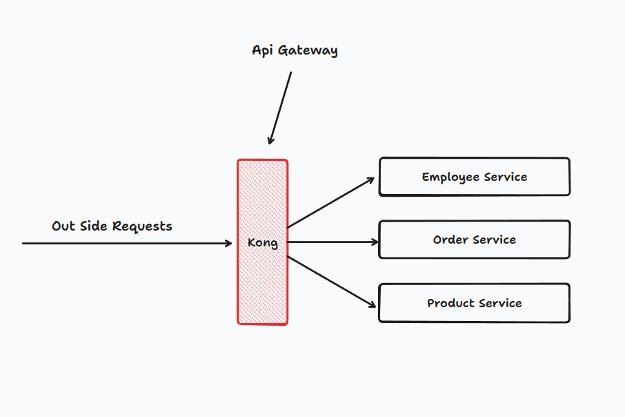
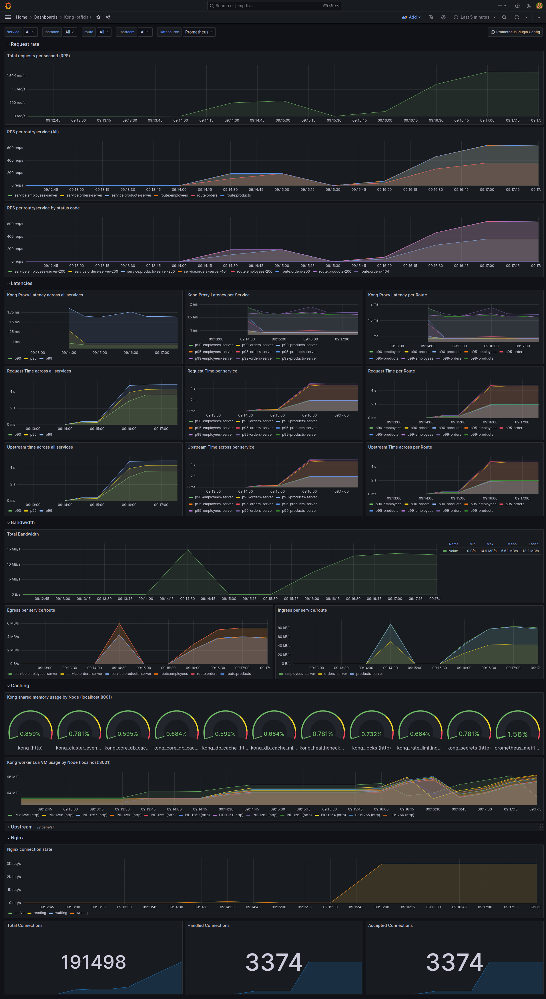

# Api Gateways Playaround
this repo for playing around with different open source api gateways to get the best fit for our usecase



## Why to use Api Gateway ?!
look at this video [What is gateway?](https://www.youtube.com/watch?v=6ULyxuHKxg8)

### Our usecase
* First Reason
* Second


## Recommendations
### Kong
first version I used kong as main api gateway and here is what I got

### Tyk
still didn't use it yet

### Docker Compose Service
* kong
* Promethus
* Grafana
* etc


### CRUD Serviecs
I use [FastApi](https://fastapi.tiangolo.com/) to make simple in memory CRUD operations
there is three main services

* Employee Service
* Order Service
* Product Serivce


## Requirments
make sure that you have theses tools installed on your machine
* Apache benchmark `ab`
* Docker
* etc

### Gettings started
edit `./config/kong.yml` services with your ip
you can get it using command
```
ifconfig | grep "192."
```
Run docker compose file
```
docker-compose up
```

after successfully running you now should have everything up and runnig

import kong grafana dashboard (ID: `7424`) after configuring promethus as data source


## Screenshots
Grafana statistics for load test

